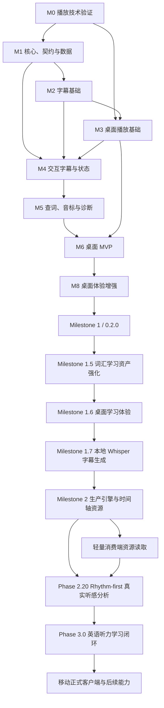

# 跨平台听力理解播放器 Roadmap

> Milestone 1、1.5、1.6、1.7、1.8 与 1.9 状态：已完成。Milestone 1.9
> 发音与词级同步基础已通过完整协同功能验收；独立分发签名与公证作为后续发布
> 工作保留，不阻塞 `0.7.0` 收口；
> 2026-06-18 路线更新：Milestone 2 主线调整为“本地重装生产引擎 +
> 轻量消费端资源读取”。M7 移动端验证、Windows/Linux 和其他延期能力
> 暂缓到生产资源闭环之后重新排序。
> 2026-06-22 路线更新：在 Milestone 2 下新增“多语言学习基础”工作流（Phase 2.5.5
> 抽象校验 → Phase 2.6 英语 + 汉语实现），与生产引擎主线并行；详见 §14.11。
> 2026-06-28 架构更新：Phase 2.18 完成非兼容式代码架构重构；学习资产 active path
> 收敛为 `LexicalEntry + LexicalUnit + LearningStatus`，旧 `WordProfile` /
> `WordObservation` 与旧兼容 adapter 不再作为后续路线基线。
> 2026-06-28 产品路线更新：新增 Phase 3.0 英语听力学习闭环方向文档，作为真实输入、
> 可理解度判断、诊断、主动练习、复习巩固、L1-aware 诊断和进度反馈的后续对齐依据。
> 2026-06-29 产品路线更新：新增 Phase 2.20 Rhythm-first listening analysis，将真实语流分析
> 的产品中心从 phone-level ribbon 调整为重音节奏框架、弱读音团、压缩区和听感解释；
> Phase 2.19 phone benchmark scoring 保留为底层 evidence-quality 工作。
> 2026-06-30 架构路线更新：新增 Phase 2.21 Audible Structure Architecture，把 Phase 2.20
> 的 rhythm-first UI/实验铺垫上升为正式 audible-structure contract；旧 `RhythmFrame` v0
> 兼容性不再阻塞新模型，后续先落实 A/B/C references、provenance、nuclei、WordTimeline
> + duration/energy substrate 和 CTC phone segmental-only ownership。
> 完成报告见 `docs/release/milestone-1.md`。

## 1. 路线图目标

本路线图用于指导从当前 LLPlayer Windows 代码库出发，建立一个新的跨平台听力理解播放器。

路线图遵循以下顺序：

```text
先验证最危险的播放器技术
  ↓
再建立稳定领域契约和数据模型
  ↓
实现字幕基础设施
  ↓
完成桌面播放器与字幕同步
  ↓
加入词汇状态、查词与诊断
  ↓
完成 macOS Apple Silicon 桌面 MVP
  ↓
强化可变状态词汇表与来源资产
  ↓
后续验证移动端复用路径
```

本文档不把真实语流分析、OpenSubtitles、位图字幕学习交互和商业化纳入
Milestone 1。Milestone 1 已包含可选 `yt-dlp` 在线播放；Milestone 1.7
已增加本地 ASR 整段字幕生成。

从 Milestone 2 开始，路线图主轴变为：

```text
LLTimeline JSON v1
  ↓
本地重装生产引擎生成精准 WordTimeline / PhoneTimeline / ChunkTimeline
  ↓
客观评估 + 人工校对
  ↓
导出可发布、可消费的时间轴资源
  ↓
轻量消费端读取资源并播放学习
```

## 2. 当前上下文快照

### 2.1 已确认的产品决策

- 产品核心是听力理解诊断，不是普通播放器或背单词软件。
- 用户首先需要一套完整、可靠的听力媒体播放基础设施。
- MVP 首期用户只有项目开发者本人。
- MVP 首先支持 macOS Apple Silicon；Windows 与 Linux 在 MVP 后实现。
- 后续需要方便开发 Android 和 iOS 客户端。
- PC 与移动端可以使用不同 UI。
- 不要求一套 UI 代码覆盖所有平台。
- 前端与共享核心通过稳定领域 API 或等价契约交互。
- 播放器高频实时能力必须位于客户端本地。
- 共享领域核心优先使用 Rust。
- LLPlayer 用于参考行为、边界案例和测试，不直接作为跨平台内核。
- MVP 不实现真实语流分析。
- Milestone 1 以 macOS MVP 0.2.0 结束。
- M0-M6 与 M8 是 Milestone 1 内部实施阶段；M7 延后到生产资源闭环稳定后重新排序。
- Milestone 1.5 聚焦词汇状态、状态历史和来源原句快照的长期存续。
- 用户选择是全局词汇状态的权威来源，系统诊断不得静默修改状态。
- Milestone 1.9 只提供规范发音和规则型语流候选，不声称检测真实音频语流。
- Milestone 2 的首要目标是生产端生成高精度时间轴资源，而不是把重模型打包进消费端。
- 轻量消费端的核心职责是读取 `.lltimeline.json`、执行高亮/chunk 播放和学习交互。
- 生产端可以使用 Python、GPU、Whisper Large-v3、WhisperX、MFA/BFA、VAD、人声分离和人工校对。
- CNN10、NBC Nightly News 等新闻类内容是首批生产管线优化对象。
- Phase 2.18 后，学习资产权威模型是 `LexicalEntry + LexicalUnit + LearningStatus`；
  旧 `WordProfile` / `WordObservation` 只属于历史文档语境，不再作为 active code path。
- Phase 2.20 后，真实语流分析默认以 rhythm-first listening frame 回答“这句话实际怎么听”，
  phone-level expected/observed 对齐保留为证据层与长期模型质量工作。
- Phase 2.21 后，actual audible structure 的权威定义从 `RhythmFrame` v0 转到
  Phase 2.21 架构锁：文本先验不能冒充实际听到的结构；L1-L3 必须能由 WordTimeline +
  dictionary/syllable structure + duration/energy 生成；CTC phone evidence 只拥有 L4
  connected-speech/segmental 解释。

### 2.2 MVP 核心闭环

```text
打开本地视频或音频
  ↓
导入 SRT / VTT
  ↓
播放位置驱动当前字幕
  ↓
点击字幕跳转 / 循环当前句
  ↓
逐词查看与设置听力状态
  ↓
查词与查看词典音标
  ↓
查看当前句听力诊断
  ↓
重启后继续使用已有状态与进度
```

### 2.3 当前代码库可参考资产

| 参考资产 | 主要价值 | 新项目策略 |
|---|---|---|
| `FlyleafLib/MediaPlayer/SubtitlesManager.cs` | 当前字幕选择、时间轴边界、字幕数据模型 | 提取行为测试，重新实现 |
| `LLPlayer/ViewModels/SubtitlesSidebarVM.cs` | 点击跳转、侧栏搜索、当前句跟随 | 参考交互，不复用 WPF |
| `LLPlayer/Views/SubtitlesSidebar.xaml` | 虚拟化文稿与当前句样式 | 参考 UI 行为 |
| `LLPlayer/Controls/SelectableSubtitleText.xaml.cs` | token 拆分与单词点击 | 将行为移入共享核心 |
| `LLPlayer/Controls/WordPopup.xaml.cs` | 查词流程和错误降级 | 映射为 Dictionary Provider 与详情 UI |
| `FlyleafLib/MediaPlayer/Player.Screamers.cs` | 播放位置与字幕刷新 | 作为实时同步路径参考 |
| `FlyleafLibTests/MediaPlayer/SubtitlesManagerTest.cs` | 字幕时间轴测试样例 | 转换为新核心测试 |

### 2.4 架构基线

目标架构：

```text
┌────────────────────────────────────────────┐
│ Desktop Client                             │
│ UI + Player Adapter + Local Timeline Cursor│
└────────────────────┬───────────────────────┘
                     │ Versioned Domain API
                     │ + Domain Events
┌────────────────────▼───────────────────────┐
│ Rust Application Service                   │
│ Media / Subtitle / Word / Dictionary /     │
│ Diagnosis Use Cases                        │
└────────────────────┬───────────────────────┘
                     │
┌────────────────────▼───────────────────────┐
│ Rust Domain Core + SQLite Persistence      │
└────────────────────────────────────────────┘
```

移动端目标形态：

```text
Android / iOS Client
  ├── Native or platform-specific Player Adapter
  ├── Mobile-specific UI
  └── Rust Core via FFI/UniFFI or compatible local API
```

重要边界：

- HTTP API 不负责视频渲染。
- HTTP API 不驱动高频播放位置更新。
- 当前字幕计算在客户端基于已加载时间轴完成。
- Rust 应用服务保持传输无关，以便桌面使用 HTTP、移动使用 FFI。

## 3. 推荐代码组织

在正式实现前，由 M0 决定新项目使用独立仓库，还是暂时放在当前仓库的新顶层目录中。

如果继续使用当前仓库，推荐结构：

```text
cross-platform/
├── Cargo.toml
├── crates/
│   ├── domain/                 # 领域模型与规则
│   ├── application/            # 用例与应用服务
│   ├── subtitle-core/          # 字幕解析、token、时间轴
│   ├── dictionary/             # Provider 与缓存
│   ├── persistence-sqlite/     # SQLite repository
│   ├── api-http/               # Axum HTTP adapter
│   ├── api-events/             # WebSocket / event schema
│   └── mobile-ffi/             # 后续移动端绑定
├── contracts/
│   ├── openapi/
│   └── events/
├── apps/
│   ├── desktop/
│   ├── android-spike/
│   └── ios-spike/
├── testdata/
│   ├── media/
│   ├── subtitles/
│   └── dictionary/
└── docs/
    ├── decisions/
    ├── architecture/
    └── verification/
```

原 LLPlayer 目录保持不变，作为参考实现。

## 4. 技术选择与决策门

### 4.1 已选技术基线

| 领域 | 基线 |
|---|---|
| 共享核心 | Rust |
| 异步运行时 | Tokio |
| 桌面本地 API | Axum |
| API 契约 | OpenAPI |
| 事件 | WebSocket + 版本化事件 Schema |
| 数据库 | SQLite |
| Rust 数据访问 | SQLx 或经 M0 决策的等价方案 |
| 序列化 | Serde |
| 桌面播放器 | 技术验证后确认 |
| 移动播放器 | Android Media3 ExoPlayer；iOS AVPlayer |

### 4.2 M0 必须决定的事项

#### 决策 A：桌面 UI 与播放器组合

候选：

1. Flutter + `media_kit/libmpv`
2. React + TypeScript + Tauri + `libmpv`
3. 其他能够通过全部播放验证的组合

决策标准按优先级排序：

1. macOS Apple Silicon 播放稳定性。
2. 播放位置事件稳定性。
3. 精确跳转与区间循环能力。
4. 视频表面与可交互字幕覆盖能力。
5. 安装包和平台依赖管理。
6. 开发效率和 UI 生态。
7. 后续移动端复用程度。

#### 决策 B：新代码位置

候选：

- 独立新仓库。
- 当前仓库下的 `cross-platform/`。

建议：

- 技术验证阶段可使用 `cross-platform/`。
- M0 结束时根据许可证、发布和版本管理需求决定是否拆分仓库。

#### 决策 C：字典数据源

M5 前必须明确：

- 在线还是离线。
- 基础释义语言。
- 美式和英式音标覆盖。
- 许可证。
- 缓存策略。
- 服务不可用时的降级。

## 5. 工作流分解

路线图由以下并行工作流组成：

| 工作流 | 内容 |
|---|---|
| W1 播放基础设施 | 平台播放器适配、位置事件、跳转、循环、轨道 |
| W2 字幕基础设施 | 解析、标准模型、token、时间轴、偏移 |
| W3 共享核心与 API | 领域模型、应用服务、OpenAPI、事件 |
| W4 数据与持久化 | SQLite、迁移、身份、缓存、备份 |
| W5 桌面 UI | 播放布局、字幕文稿、单词详情、诊断 |
| W6 学习能力 | 词汇状态、观察、字典、诊断 |
| W7 质量工程 | 契约测试、跨平台验证、性能、故障恢复 |
| W8 移动准备 | FFI、移动播放器映射、触控原型 |

关键路径：

```text
M0 播放技术验证
  → M1 核心契约
  → M2 字幕基础
  → M3 桌面播放
  → M4 交互字幕
  → M5 查词与诊断
  → M6 MVP 集成
```

M1 与部分 M2 可以在 M0 后半段并行，但不能在桌面播放器技术验证失败时继续大规模投入 UI。

## 6. 里程碑 M0：架构基线与播放技术验证

> 状态：已完成。2026-06-09 在 macOS Apple Silicon 选定 Flutter +
> media_kit；验证记录与风险见 `docs/verification/macos-m0-checklist.md`。

### 6.1 目标

在正式开发前消除最高风险：确认一套能够支撑桌面跨平台听力训练的播放器与 UI 技术组合。

### 6.2 覆盖需求

- ARCH-002
- ARCH-004 至 ARCH-006
- ARCH-009
- API-013
- NFR-016
- TEST-001
- TEST-013

### 6.3 主要任务

#### 任务 M0.1：建立 LLPlayer 行为基线

- 阅读并记录 LLPlayer 的字幕时间轴、点击跳转、当前句切换、侧栏跟随和查词行为。
- 从现有测试与代码中整理边界案例。
- 建立行为矩阵：
  - 正常字幕时间段。
  - 字幕空隙。
  - 字幕重叠。
  - 跳转前后当前句。
  - 首句和末句。
  - 单句循环。
  - 字幕偏移。
- 记录哪些行为必须保持，哪些可以重新定义。

#### 任务 M0.2：建立测试媒体集

- 准备许可清晰的小型视频、音频、SRT 和 VTT。
- 包含：
  - 短视频。
  - 纯音频。
  - 多音轨或多字幕轨道媒体。
  - 字幕空隙。
  - 字幕重叠。
  - 2,000 条以上长字幕。
  - 包含缩写、撇号、连字符和换行的文本。
- 为每个测试文件记录预期行为。

#### 任务 M0.3：Flutter + media_kit 播放原型

- 在 macOS Apple Silicon 验证：
  - 打开视频和音频。
  - 视频渲染。
  - 播放、暂停。
  - 位置事件。
  - 精确跳转。
  - 倍速。
  - 区间循环。
  - 轨道发现。
  - 视频上方覆盖交互字幕层。
- 记录平台依赖、打包方式和已知问题。

#### 任务 M0.4：React/TS + Tauri + libmpv 原型

- 验证与 M0.3 相同能力。
- 特别验证：
  - libmpv 视频表面嵌入。
  - WebView 与原生视频表面层级。
  - 可点击字幕覆盖。
  - 跨平台打包复杂度。

如果早期即发现不可接受阻塞，可停止该候选并记录原因。

#### 任务 M0.5：定义播放器适配器契约草案

契约至少覆盖：

```text
open
play
pause
stop
seek
position stream
duration
playback state
volume
playback rate
audio tracks
subtitle tracks
loop range
error events
```

- 为契约设计平台无关类型。
- 记录精确跳转和区间循环允许误差。
- 评估 ExoPlayer 与 AVPlayer 是否能映射。

#### 任务 M0.6：技术决策

- 输出桌面技术栈 ADR。
- 输出播放器适配器 ADR。
- 输出新代码仓库位置 ADR。
- 输出第三方许可证清单初版。

### 6.4 交付物

- 桌面播放器技术原型。
- macOS 验证记录与未来平台风险清单。
- 测试媒体集。
- LLPlayer 行为基线文档。
- 播放器适配器契约草案。
- 技术决策记录。
- 初版许可证清单。

### 6.5 退出条件

- 至少一个桌面技术候选在 macOS Apple Silicon 通过核心播放验证。
- 可以在视频上方显示可点击字幕覆盖层。
- 位置事件可以稳定驱动字幕切换。
- 点击字幕跳转与区间循环达到可接受训练体验。
- 已明确桌面客户端技术基线。
- 已明确不能进入 HTTP API 的播放能力。

### 6.6 停止条件

若没有候选能够满足 macOS 播放、字幕覆盖和区间循环，则暂停后续产品开发，重新评估：

- 原生 Qt/C++ 播放器外壳。
- 分平台桌面播放器实现。
- 原生 macOS 播放器实现。

### 6.7 建议投入

单人开发建议投入 1 至 2 周。macOS 验证通过并形成技术 ADR 后可以进入 M1。

## 7. 里程碑 M1：共享核心、契约与数据基础

> 状态：已完成。2026-06-09 完成 Rust 共享核心、SQLite Schema 与迁移、
> loopback 本地 API、OpenAPI 和事件契约；验证记录见
> `docs/verification/m1-report.md`。

### 7.1 目标

建立与 UI、播放器和传输层无关的 Rust 共享核心，并完成本地 API、事件和 SQLite 基础。

### 7.2 覆盖需求

- ARCH-001 至 ARCH-003
- ARCH-007、ARCH-008
- PLAT-004
- API-001 至 API-004、API-012
- DATA-001 至 DATA-003、DATA-006 至 DATA-008、DATA-010
- WORD-001、WORD-002、WORD-007
- NFR-006、NFR-009、NFR-010、NFR-012、NFR-015、NFR-017
- TEST-005、TEST-007 至 TEST-009

### 7.3 主要任务

#### 任务 M1.1：创建 Rust workspace

- 建立 `domain`、`application`、`persistence-sqlite`、`api-http` 和 `api-events` 边界。
- 配置格式化、静态检查、测试和 CI。
- 设置依赖方向检查或评审规则。

#### 任务 M1.2：定义领域模型

- 定义：
  - `MediaItem`
  - `SubtitleTrack`
  - `SubtitleSentence`
  - `SubtitleToken`
  - `WordProfile`
  - `WordObservation`
  - `DictionaryEntry`
  - `SentenceDiagnosis`
- 明确 ID 类型、时间单位、语言代码和序列化值。
- 明确全局词汇状态与上下文观察的区别。

#### 任务 M1.3：定义 Repository 接口

- Media Repository。
- Subtitle Repository。
- Word Profile Repository。
- Word Observation Repository。
- Dictionary Cache Repository。
- Playback Progress Repository。

Repository 接口位于领域或应用层，SQLite 实现位于持久化层。

#### 任务 M1.4：建立 SQLite Schema

- 建立初始迁移。
- 定义唯一约束和外键。
- 定义媒体、字幕和词汇身份策略。
- 为批量查询和时间轴读取建立索引。
- 为迁移前备份预留机制。

#### 任务 M1.5：建立应用服务

- Register Media。
- Read/Update Playback Progress。
- Read/Update Word Profile。
- Create Word Observation。
- 定义后续字幕、字典和诊断用例接口。

#### 任务 M1.6：建立本地 API

- Axum 本地服务。
- loopback 绑定。
- 随机令牌或等价本地访问保护。
- 统一错误模型。
- 健康检查。
- 服务启动与关闭协议。

#### 任务 M1.7：建立契约

- OpenAPI 初版。
- 版本化事件 Envelope。
- 客户端类型生成实验。
- 契约兼容性测试。

### 7.4 交付物

- 可编译、可测试的 Rust workspace。
- 初版 SQLite Schema 与迁移。
- Media、Progress、Word Profile、Observation 应用服务。
- 本地 HTTP API 与 OpenAPI。
- 事件 Schema。
- 架构与数据模型文档。

### 7.5 退出条件

- 核心业务服务可在无 UI 环境运行。
- 数据库迁移、幂等登记和状态持久化测试通过。
- HTTP handler 不包含领域规则。
- API 默认只允许本地访问。
- 客户端可以通过生成或手写 SDK 调用健康检查、媒体登记和词汇状态接口。

### 7.6 建议投入

单人开发建议投入 1.5 至 3 周。

## 8. 里程碑 M2：字幕基础设施

> 状态：已完成。2026-06-09 完成 SRT/WebVTT、英语 token 化、客户端时间轴、
> 字幕持久化与导入/读取 API；验证记录见 `docs/verification/m2-report.md`。

### 8.1 目标

建立可复用、可测试的字幕导入、标准化、token 化和时间轴能力。

### 8.2 覆盖需求

- SUB-001 至 SUB-007、SUB-009
- TXT-001、TXT-009、TXT-010
- WORD-006
- API-005
- DATA-004、DATA-005
- TEST-002、TEST-003

### 8.3 主要任务

#### 任务 M2.1：定义标准字幕模型

- 统一时间单位。
- 定义轨道、句子、token 的稳定 ID。
- 保留原始文本和标准化显示文本。
- 定义字幕来源和内容指纹。

#### 任务 M2.2：实现 SRT 解析

- 支持常见编码与换行。
- 对格式错误提供上下文。
- 建立固定测试样例。

#### 任务 M2.3：实现 WebVTT 解析

- 支持基础 cue。
- 对不支持标签进行安全降级。
- 建立固定测试样例。

#### 任务 M2.4：实现英语 token 化

- token 类型：
  - word
  - whitespace
  - punctuation
  - other
- 保留字符范围和原始词形。
- 覆盖缩写、撇号、连字符、数字、Unicode 和换行。
- 实现 lemma/规范化键初版。
- 无法确定 lemma 时安全回退到规范化词形。

#### 任务 M2.5：实现时间轴引擎

- 根据位置查询当前句。
- 查询上一句和下一句。
- 定义边界、空隙和重叠规则。
- 支持字幕偏移后的时间计算。
- 提供客户端可移植的时间轴数据。

#### 任务 M2.6：字幕持久化与导入用例

- 导入字幕文件。
- 内容指纹与重复导入幂等。
- 文件变化处理。
- 批量事务写入。
- 读取完整标准化轨道。

#### 任务 M2.7：字幕 API

- 导入接口。
- 获取轨道接口。
- 获取句子和 token 接口。
- 统一解析错误。

### 8.4 交付物

- SRT 与 VTT 解析器。
- 标准字幕模型。
- 英语 token 化与规范化逻辑。
- 时间轴引擎。
- 字幕导入与读取 API。
- 字幕行为和 token 固定测试集。

### 8.5 退出条件

- 测试字幕可以导入、持久化并完整读取。
- token 重组保持显示文本。
- 当前句查询覆盖空隙、重叠和边界。
- 重复导入不会重复写入。
- 客户端可以一次获取完整时间轴并本地查询当前句。

### 8.6 建议投入

单人开发建议投入 2 至 3 周。

## 9. 里程碑 M3：桌面播放基础设施

> 状态：已完成。2026-06-09 完成正式 Flutter 桌面外壳、本地字幕 Cursor、
> 句级跳转/循环、偏移和播放器控制；验证见 `docs/verification/m3-report.md`。

### 9.1 目标

将 M0 选定的播放器方案实现为正式桌面播放器外壳，完成媒体播放、字幕同步和句子级控制。

### 9.2 覆盖需求

- PLAY-001 至 PLAY-012
- SUB-008、SUB-010、SUB-011
- UI-001 至 UI-003、UI-011
- NFR-013
- TEST-004

### 9.3 主要任务

#### 任务 M3.1：实现正式播放器适配器

- 按 M0 契约实现打开、播放、暂停、停止和状态事件。
- 实现位置、时长、速度和音量。
- 实现轨道发现与选择。
- 统一播放器错误。

#### 任务 M3.2：实现客户端时间轴 Cursor

- 加载后端返回的完整字幕轨道。
- 使用播放器位置事件更新当前句。
- 当前句变化事件仅在句子真正变化时发出。
- 支持字幕偏移。

#### 任务 M3.3：实现跳转与相邻句导航

- 点击句子跳转。
- 上一句和下一句。
- 跳转后立即更新当前句。
- 首尾边界行为。

#### 任务 M3.4：实现区间循环

- 当前句区间循环。
- 循环开关。
- 当前句变化时更新区间。
- 处理字幕结束时间缺失或异常。
- 记录不同平台允许误差。

#### 任务 M3.5：实现基础桌面 UI

- 视频/音频区域。
- 播放控制栏。
- 媒体文件选择。
- 字幕文件选择。
- 当前时间与总时长。
- 倍速和音量。
- 错误反馈。

#### 任务 M3.6：播放器契约验证

- 对正式适配器运行契约测试。
- 在 macOS Apple Silicon 运行测试媒体集。
- 记录未来 Windows 与 Linux 适配风险。

### 9.4 交付物

- 正式桌面播放器外壳。
- 播放器适配器。
- 客户端本地字幕 Cursor。
- 基础字幕显示。
- 跳转、上一句、下一句和区间循环。
- macOS 播放器验证记录。

### 9.5 退出条件

- macOS Apple Silicon 可以打开测试视频和音频。
- 字幕当前句稳定同步。
- 点击字幕跳转和单句循环达到日常训练可用程度。
- 字幕偏移在跳转、当前句和循环中语义一致。
- 后端服务暂时失联时，已加载媒体仍能基本播放和同步。

### 9.6 建议投入

单人开发建议投入 2 至 4 周。播放器平台问题可能扩大工期，不能以业务功能掩盖播放缺陷。

## 10. 里程碑 M4：可交互字幕与词汇状态

> 状态：已完成。2026-06-09 完成逐词字幕、批量状态、SSE 缓存更新和上下文观察；
> 验证见 `docs/verification/m4-report.md`。

### 10.1 目标

完成 MVP 最核心的字幕学习交互：逐词状态显示、快速标记和上下文观察。

### 10.2 覆盖需求

- SUB-012
- TXT-002 至 TXT-006、TXT-008
- WORD-003 至 WORD-009
- API-006 至 API-009
- UI-004、UI-005、UI-008、UI-009
- NFR-003、NFR-005

### 10.3 主要任务

#### 任务 M4.1：实现字幕文稿

- 使用虚拟化列表或等价机制。
- 显示全部字幕句。
- 当前句高亮。
- 自动跟随当前句，同时尊重用户主动滚动。
- 点击句子跳转。

#### 任务 M4.2：实现逐词字幕渲染

- 播放画面当前字幕逐词显示。
- 文稿字幕逐词显示。
- 单词、空格和标点保持原始顺序。
- 单词点击与句子点击事件分离。

#### 任务 M4.3：实现批量状态加载

- 从当前轨道收集去重 lemma。
- 批量读取状态。
- 客户端缓存。
- 未分类词不预写数据库。
- 状态变化事件更新缓存。

#### 任务 M4.4：实现状态样式

- 尚未判断。
- 不认识。
- 认识但听不出。
- 认识且能听出。
- 样式不只依赖颜色。
- 支持关闭状态样式。

#### 任务 M4.5：实现全局状态修改

- 单击或快捷操作打开状态选择。
- 创建、更新、清除状态。
- 可见相同 lemma 实时更新。
- 异步持久化和失败反馈。

#### 任务 M4.6：实现上下文观察

- 本次听出。
- 本次未听出。
- 明确与全局状态的区别。
- 保存当前字幕句和原始词形。

#### 任务 M4.7：隐藏字幕复听

- 临时隐藏当前字幕。
- 保持播放、循环和当前句同步。
- 快速恢复字幕。

### 10.4 交付物

- 可交互字幕文稿。
- 播放画面逐词字幕。
- 全局词汇状态。
- 当前句上下文观察。
- 状态 API 与事件。
- 客户端状态缓存。

### 10.5 退出条件

- 用户可以边播放边快速标记三类有效状态。
- 状态修改后当前字幕和文稿即时更新。
- 重启应用后状态仍然存在。
- 文稿加载不存在逐词 API 查询。
- 2,000 条字幕文稿能够保持可用。
- 用户能够理解全局状态与本句观察的区别。

### 10.6 建议投入

单人开发建议投入 2 至 4 周。

## 11. 里程碑 M5：查词、音标与当前句诊断

> 状态：已完成。2026-06-09 完成字典 Provider、缓存、词详情和可解释诊断；
> 验证见 `docs/verification/m5-report.md`。

### 11.1 目标

完成从单词状态到听力障碍解释的 MVP 学习闭环。

### 11.2 覆盖需求

- DICT-001 至 DICT-006、DICT-010
- DIAG-001 至 DIAG-008
- API-010、API-011
- DATA-009
- UI-006、UI-007
- NFR-011、NFR-014、NFR-018
- TEST-006

### 11.3 主要任务

#### 任务 M5.1：确定字典数据源

- 比较候选数据源。
- 确认基础释义、音标、调用限制和许可证。
- 记录是否需要联网。
- 确定缓存有效期和失败降级。

#### 任务 M5.2：实现 Dictionary Provider

- 统一请求与响应模型。
- 实现首个 Provider。
- 超时、取消和错误映射。
- 本地缓存。
- 无结果与离线降级。

#### 任务 M5.3：实现单词详情面板

- 当前词形。
- lemma。
- 全局状态。
- 当前句观察。
- 基础词义。
- 美式或英式词典音标。
- 状态修改。
- 查询加载、错误与无结果状态。

#### 任务 M5.4：实现诊断规则

- 输入：
  - 当前字幕句。
  - token。
  - 全局词汇状态。
  - 当前句观察。
- 输出：
  - 不认识词列表。
  - 认识但听不出词列表。
  - 未分类词列表。
  - 词义障碍提示。
  - 声音识别障碍提示。
  - 信息不足提示。
  - 其他可能因素提示。
  - 每条提示的依据。

#### 任务 M5.5：实现诊断 API

- 按字幕句生成诊断。
- 状态变化后重新计算。
- 保持规则确定性。

#### 任务 M5.6：实现当前句诊断 UI

- 显示诊断结论和依据词。
- 支持点击依据词打开详情。
- 明确显示信息不足。
- 不将诊断表达为绝对事实。

### 11.4 交付物

- 首个字典 Provider。
- 字典缓存。
- 单词详情面板。
- 词典音标展示。
- 当前句诊断规则、API 和 UI。
- 字典许可证与隐私说明。

### 11.5 退出条件

- 点击单词可查看词义和至少一种词典音标。
- 字典离线或失败时，播放和词汇状态仍正常。
- 当前句诊断能区分词义障碍、声音识别障碍和信息不足。
- 每条诊断都能显示依据。
- 诊断规则单元测试通过。

### 11.6 建议投入

单人开发建议投入 2 至 3 周。

## 12. 里程碑 M6：桌面 MVP 集成与质量加固

> 状态：已完成。2026-06-09 完成 macOS Apple Silicon MVP 集成、质量加固与发布包验收；
> 验证见 `docs/verification/m6-mvp-report.md`。

### 12.1 目标

完成 macOS Apple Silicon 桌面 MVP，达到可用于日常听力训练的稳定程度。

### 12.2 覆盖需求

- PLAT-002、PLAT-004
- PLAY-013
- SUB-016
- DATA-011
- UI-010
- NFR-001 至 NFR-018 中尚未完成项
- TEST-010 至 TEST-014

### 12.3 主要任务

#### 任务 M6.1：端到端核心流程

在 macOS Apple Silicon 完成：

1. 打开媒体。
2. 导入字幕。
3. 播放与字幕同步。
4. 点击跳转。
5. 单句循环。
6. 单词状态标记。
7. 查词和音标。
8. 当前句诊断。
9. 重启后恢复状态和进度。

#### 任务 M6.2：性能加固

- 播放期间状态写入。
- 大字幕轨道加载。
- 文稿虚拟化。
- 状态批量查询。
- 当前句变化渲染。
- API 与事件频率。
- 内存占用观察。

#### 任务 M6.3：故障恢复

- 字典超时。
- 核心服务启动失败。
- 端口冲突。
- 数据库迁移失败。
- 数据库损坏或不可写。
- 媒体文件移动或删除。
- 字幕文件变化。
- 播放器解码失败。

#### 任务 M6.4：数据可靠性

- 迁移前备份。
- 手工备份与恢复说明。
- 崩溃后数据一致性验证。
- 重复导入和幂等验证。

#### 任务 M6.5：快捷键与日常体验

- 播放暂停。
- 上一句、下一句。
- 循环当前句。
- 隐藏字幕。
- 三种状态快速标记。
- 打开单词详情。

#### 任务 M6.6：打包与发布

- macOS 发布包。
- macOS 平台依赖说明。
- 版本信息。
- 诊断日志导出。
- 已知问题列表。

#### 任务 M6.7：真实材料手工验收

- 使用至少一段 CNN10 或 NBC 类长视频。
- 使用至少一个纯音频材料。
- 连续完成日常训练流程。
- 记录阻断性问题、摩擦点和后续需求。

### 12.4 交付物

- macOS Apple Silicon 桌面 MVP。
- 发布包与安装说明。
- 端到端验证报告。
- 性能报告。
- 故障恢复报告。
- 数据备份与恢复说明。
- 已知问题和后续需求清单。

### 12.5 发布门槛

- macOS Apple Silicon 通过核心流程。
- 没有已知数据丢失问题。
- 没有阻断播放、字幕同步、状态修改或诊断的严重问题。
- 大字幕文稿可用于实际训练。
- 字典失败不会破坏核心流程。
- 关闭学习功能后仍可作为基础本地播放器使用。
- 所有 P0 需求已完成或有明确书面例外。

### 12.6 建议投入

单人开发建议投入 2 至 4 周。

## 12.5 Milestone 1.5：词汇学习资产强化

> 状态：已完成。2026-06-10 发布 0.3.0；验证见
> `docs/verification/milestone-1.5-report.md`。

### 12.5.1 目标

将可变状态词汇表确立为产品最重要的持久化资产。媒体与字幕用于增强来源
定位和复听体验，但其缺失、移动或删除不得损坏词汇状态、历史和原句快照。

### 12.5.2 覆盖需求

- WORD-011 至 WORD-018
- API-014 至 API-017
- DATA-012 至 DATA-016
- UI-013 至 UI-015
- TEST-015 至 TEST-018

### 12.5.3 主要任务

#### M1.5-A：持久化模型与迁移

- 新增词汇来源快照与词汇状态历史。
- 状态更新与历史、来源写入使用事务。
- 媒体和字幕句关联改为可空，并在删除时置空而非级联清除学习资产。
- 当前句观察使用最新有效值，并支持清除。
- 增加媒体可用、缺失和重新定位状态。

#### M1.5-B：状态驱动词汇本与详情

- 建立不认识、认识但听不出、已掌握三个动态词汇本。
- 支持搜索、筛选、排序、最近遇见时间和遇见次数。
- 状态变化后立即移动词汇，不复制 Profile。
- 在词汇详情展示当前状态、历史和来源原句。

#### M1.5-C：来源复听与缺失媒体恢复

- 媒体可用时从来源原句跳转或循环复听。
- 媒体不可用时保留快照并明确显示不可播放状态。
- 支持按内容指纹重新定位媒体并恢复来源跳转。
- 默认归档或删除行为保留词汇学习资产。

#### M1.5-D：独立备份与验收

- 独立导出、备份与恢复词汇 Profile、状态历史、来源快照和观察。
- 在无媒体、无字幕文件环境中执行恢复测试。
- 验证大词汇表查询、搜索和状态切换性能。
- 完成动态词汇本端到端验收。

### 12.5.4 退出条件

- 用户选择是全局词汇状态的唯一权威修改来源。
- 三个动态词汇本与当前状态始终一致，不产生重复 Profile。
- 状态历史和来源原句快照可查询、搜索和独立导出。
- 媒体移动、缺失或删除不会级联删除词汇学习资产。
- 媒体存在时可返回来源原句；缺失时具有明确降级与重新定位入口。
- 即使所有原始媒体与字幕文件均不可用，用户仍能完整查看、搜索、备份和
  迁移自己的词汇状态、状态历史与来源原句快照。

### 12.5.5 明确延期

- 自动推断或自动修改词汇状态。
- 复杂间隔重复、每日复习计划和按词义拆分状态。
- 云同步、Anki 集成与移动端验证。

### 12.5.6 建议投入

单人开发建议投入 2 至 4 周。

## 13. 延期候选阶段 M7：移动端技术验证

### 13.1 目标

2026-06-18 路线调整后，M7 不再是 Milestone 2 的首要候选。它保留为
`.lltimeline.json` 资源格式、生产引擎和轻量消费端资源读取稳定后的后续验证阶段。

在不启动完整移动产品开发的前提下，证明桌面阶段建立的核心与契约可以支撑 Android 和 iOS。

### 13.2 覆盖需求

- ARCH-010
- UI-012
- MOB-001 至 MOB-008

### 13.3 主要任务

#### 任务 M7.1：Rust 核心移动绑定

- 选择 FFI/UniFFI 或等价方案。
- Android 调用核心应用服务。
- iOS 调用核心应用服务。
- 验证 SQLite 沙箱路径。

#### 任务 M7.2：Android 播放原型

- Media3 ExoPlayer。
- 打开本地媒体。
- 位置事件。
- 字幕时间轴本地同步。
- 跳转、倍速和区间循环。
- 触控单词状态标记。

#### 任务 M7.3：iOS 播放原型

- AVPlayer。
- 打开本地媒体。
- 时间观察。
- 字幕时间轴本地同步。
- 跳转、倍速和区间循环。
- 触控单词状态标记。

#### 任务 M7.4：契约兼容验证

- 复用桌面领域模型。
- 复用词汇状态和诊断规则。
- 验证移动端不需要新增不兼容核心概念。
- 记录必须调整的 API 或 FFI 设计。

### 13.4 交付物

- Android 技术原型。
- iOS 技术原型。
- Rust 移动绑定原型。
- 移动端契约兼容报告。
- 正式移动客户端路线建议。

### 13.5 退出条件

- 至少能在 Android 和 iOS 中调用共享核心。
- 两个平台能够映射统一播放器契约的核心能力。
- 能够完成“播放、字幕同步、点击单词、修改状态”的最小流程。
- 未发现需要重写共享领域核心的根本性问题。

### 13.6 建议投入

单人开发建议投入 2 至 4 周。

## 14. Milestone 1 收口与后续路线

### 14.0 Milestone 1 阶段 M8：LLPlayer 核心体验增强

> 状态：已完成。2026-06-09 完成双文本字幕、外观设置、拖放、内嵌文本字幕
> 学习化与 `yt-dlp` 在线播放适配；验证见 `docs/verification/m8-report.md`。

本阶段优先实现以下桌面能力：

1. 双文本字幕同时显示，主字幕保留完整学习交互。
2. 字幕字体、大小、颜色、背景透明度、位置和文稿宽度设置。
3. 完整设置页面与版本化持久化。
4. 拖放打开本地媒体和主、副字幕。
5. 使用 `ffprobe`/`ffmpeg` 将内嵌文本字幕转换为标准学习字幕。
6. 使用独立 `yt-dlp` 适配器解析在线视频并交给播放器。

OpenSubtitles 下载、位图字幕显示和位图字幕 OCR/学习交互暂缓，不属于
M8 退出条件。

#### M8 退出条件

- 主、副文本字幕可独立导入、同步、显示和调整偏移。
- 主字幕可继续完成点击单词、查词、状态修改和诊断。
- 设置页面可即时预览并在重启后恢复。
- 拖放媒体和字幕可用。
- 支持的内嵌文本字幕可转换为学习字幕。
- 合法、受支持的在线视频 URL 可经 `yt-dlp` 解析播放。
- 外部工具缺失时，本地播放器核心流程仍然可用。

### 14.1 Milestone 2 主线：LLTimeline JSON v1

- 定义 `llplayer.timeline.v1` 交换格式，兼容 OpenAI/WhisperX segment/word 骨架。
- 增加 metadata 头部：媒体指纹、ASR/aligner/VAD/chunk 算法版本、人声分离配置、
  是否人工校对、生成时间、校验摘要和发布信息。
- `words` 支持 `type`：`word`、`silence`、`breath`、`noise`、`music`、`speaker_change`。
- `words` 支持 speaker、confidence、source、provider/version、可选 phonemes。
- `chunks` 支持 algorithm candidate、user-adjusted、active/archived 状态。
- 消费端导入 `.lltimeline.json` 后无需运行 ASR/FA 即可驱动词级高亮和 chunk 播放。

### 14.2 Milestone 2 主线：本地重装生产引擎

- 预处理：抽取音频、响度归一、人声分离、VAD、可选说话人切换。
- ASR：优先使用 Whisper Large-v3 或更强本地模型生成高准确 transcript。
- 强制对齐：WhisperX 作为首个实用候选，MFA/BFA 作为英语新闻类参考或增强候选。
- Timeline：保留 DTW、WhisperX、MFA/BFA、pause-refined、user-adjusted 多个候选。
- Chunk：结合 VAD 停顿、speaker change、标点、语义和 150ms 级 gap 阈值生成候选。
- 人工校对：在本地播放器中预览词跳动和 chunk，支持拖拽边界、合并/拆分 chunk。
- 输出：导出 `.lltimeline.json`、评估报告、可发布学习视频资源。

### 14.3 Milestone 2 主线：客观评估与 Benchmark

- 弱评估：比较 DTW / WhisperX / MFA / final timeline 的偏移、覆盖、异常 gap、尾词 lag。
- Gold 评估：使用少量 TIMIT、Buckeye 高质样本验证词/音素边界误差。
- 新闻 gold set：为 CNN10/NBC Nightly News 自建少量人工校对样本。
- 生产抽检：每个发布视频记录评估摘要和人工修改率。
- 关键指标：词高亮偏移、快语速滞后、句尾拖尾、chunk 修改率、用户可接受度。

### 14.4 后续候选：移动正式客户端

- 在 `.lltimeline.json` 资源格式稳定后再推进 Android 与 iOS 独立 UI。
- 移动端优先消费已有资源，不承担重模型生产。
- 文件导入、分享入口、移动生命周期、触控字幕交互和电量优化仍是后续重点。

### 14.5 在线内容增强

- Milestone 1 已支持合法直接媒体 URL 与基础 `yt-dlp` 解析。
- 后续评估登录、Cookie、更新机制和平台政策。
- 内容获取与播放器、字幕核心保持适配器边界。

### 14.6 词典与音标增强

- 多 Provider。
- 标准发音播放。
- 句子逐词音标层。
- 用户编辑词义和音标。

### 14.7 听力复习

- 汇总上下文未听出记录。
- 返回原句循环复听。
- 简单复习队列。
- 在真实使用验证后再考虑复杂记忆算法。

### 14.8 真实语流分析研究

真实语流分析不再作为消费端内置重功能推进，而是优先在生产端产生可验证资源：

- 词级时间对齐。
- 音素级对齐。
- 词典音标与真实音频对比。
- 弱读、连读、省音和失爆候选检测。
- 置信度和人工抽样验证。
- 防止错误结果误导用户的产品机制。

2026-06-29 起，本方向进一步调整为 rhythm-first：

- 默认产品视图先展示 stress anchors、weak groups、compression spans、phrase boundaries
  和 listening hotspots。
- PhoneTimeline / CTC / expected-vs-observed phone alignment 作为证据层，支撑局部解释，
  不再作为默认主视图。
- 评测体系同时报告 phone evidence quality 和 listening explanation quality，避免用 PER
  单一指标判断产品价值。

### 14.9 Milestone 1.6：桌面学习体验与词汇初始化强化

> 状态：已完成。2026-06-10 发布 0.4.0；验证见
> `docs/verification/milestone-1.6-report.md`。

- 响应式字幕尺寸与观影、学习、紧凑预设。
- 中英文界面即时切换。
- TXT/CSV 已有词表导入，默认保留本机状态。
- 统一词汇学习面板、用户释义和个人笔记。
- Provider 无关的多来源词典聚合接口与 UI。

### 14.10 Milestone 1.7：本地 Whisper 字幕生成

> 状态：已完成。2026-06-10 发布 0.5.0；验证见
> `docs/verification/v0.5.0-report.md`。详细设计见 `docs/planning/milestone-1.7.md`。
> ASR 与模型管理交互规范见 `docs/planning/milestone-1.7-asr-ui.md`。

- 建立平台无关的 `TranscriptionProvider` 与持久化生成任务模型。
- 将 Provider、运行时引擎、模型资产和用户转录配置拆分，使用能力声明与
  兼容性协商支持未来非 Whisper 模型。
- macOS Apple Silicon 首版通过 whisper.cpp 为本地视频和音频生成字幕。
- 生成结果自动持久化为现有可点击学习字幕，并支持导出 SRT。
- 支持模型与工具校验、语言选择、进度、取消、失败恢复和重试。
- 参考 LLPlayer 的主副字幕 ASR 入口、模型下载管理、语言与高级参数体验，
  同时保持正常流程与具体模型家族无关。
- 后续再增加无时间轴稿件强制对齐、当前播放位置增量生成和其他 Provider。

### 14.11 Milestone 2 工作流：多语言学习基础

> 状态：Phase 2.5.5 抽象校验已收口；**Phase 2.6 实现已收口**（en + zh，2026-06-22，
> 见 `.planning/phases/2.6-multilingual-learning-foundation/2.6-CLOSEOUT.md`）。
> 决策见 `docs/decisions/0012-multilingual-learning-abstraction.md`。

与 14.1–14.3 生产引擎主线并行的独立工作流，把产品从英语优先扩展为语言能力可插拔的
听力学习底座。首批真实验收语言为英语 + 汉语，架构对主流 top-15 学习语言封顶有效。

- **Phase 2.5.5 语言学习抽象校验**（已完成）：用真实二语习得研究校验抽象，用日语、
  阿拉伯语做类型学证伪，锁定理解轴不变量、能力矩阵 + provider、母语过滤诊断、开放
  taxonomy、听觉单位为视图等决策。
- **Phase 2.6 多语言学习基础**（已完成）：语言能力矩阵 / profile、语言感知 tokenizer、
  LexicalUnit（粒度 × 归一）、去除 `language=en` 硬编码、汉语词典/拼音 provider（CC-CEDICT）、
  汉语最小学习面板（逐字拼音）与语言感知诊断（听辨因素，possibilities 非检测）、英语 + 汉语
  双语言回归测试。
- 覆盖需求：LANG-001/002/003/005/006/007/008/010 已实现；LANG-004（听觉锚定观察）、
  LANG-009（L1 seam）按设计仅留 seam，待真实声音侧落地后实现。
- 与生产引擎边界：本工作流主要在消费端（分词、词汇、词典、诊断、UI）；非英语音频 →
  听觉单位的生产管线（中文 ASR/FA/声调）是后续独立生产端 program，不在 2.6 承诺内。

退出条件（方向）：

- 英语路径不回退。
- 同一 UI 可打开英语和汉语字幕，按各自语言查询词汇状态、查词与诊断。
- 新增主流语言主要是 provider + profile 工作，不需改动既有语言代码。

### 14.12 Phase 3.0：英语听力学习闭环

> 状态：已建立规划参考，不代表立即替代 Phase 2.17 真实媒体声音线 QA。
> 方向文档见 `.planning/phases/3.0-english-listening-learning-loop/3.0-CONTEXT.md` 与
> `.planning/phases/3.0-english-listening-learning-loop/3.0-PLAN.md`。

Phase 3.0 的目标是在 Phase 2 的真实声音流资源和 Phase 2.18 的新学习资产架构之上，
把英语作为第一门语言做成完整学习闭环：

```text
真实输入
  -> 可理解度判断
  -> 听力障碍诊断
  -> 主动验证练习
  -> 复习巩固
  -> 进度反馈
  -> 回到真实输入
```

核心产品判断：

- 真正语言能力来自听力突破，听力突破来自大量可理解输入。
- 常见语言学习软件能力需要被重新解释为听力本位能力。
- 词汇学习的目标不是只记住释义，而是在真实音频中识别词和短语。
- Cloze、听写、字幕渐隐和 chunk replay 是把被动诊断转成主动验证的优先路径。
- Anki / SRS 应作为真实语境复习的互操作或补充，不应限制 LLPlayerNext 的权威学习资产模型。
- L1 与 L2 理论应进入诊断层，首个真实组合为 Mandarin L1 -> English L2。

Phase 3.0 的高层工作流：

1. **真实媒体证据地基**：先完成 Phase 2.17，固定 sound-line marker 在真实媒体中的可信边界。
2. **可理解输入与模式分离**：建立材料难度信号，并区分精听 / 泛听体验。
3. **字幕渐隐与主动验证**：支持延迟字幕、点击显示、cloze、chunk / sentence dictation。
4. **听力驱动词汇与复习**：词汇详情围绕真实片段、来源 chunk、练习结果和 SRS 队列展开。
5. **本地 YouGlish-like 个人语料库**：从用户媒体中搜索词、短语、chunk 和语流现象。
6. **L1-aware diagnosis**：为 Mandarin -> English 建立弱读、schwa、词尾辅音、flapping、
   stress-timed rhythm 等难点解释与专项练习。
7. **Shadowing 与录音对比**：优先做 chunk-level 跟读、可调速播放和 A-B 录音对比，不先承诺复杂发音评分。
8. **诊断型 dashboard**：统计服务“哪里听不懂、是否变好了、下一步练什么”，而不是做打卡装饰。

Phase 3.0 的第一个架构地基阶段为：

- **Phase 3.0.1 Learning Loop Architecture Foundation**（backend foundation 已落地）：定义
  Practice / Review / LearningEvent / Corpus / Difficulty / LearnerProfile / Recording 边界，并以
  cloze + chunk dictation 作为第一条 backend vertical slice。参考
  `.planning/phases/3.0.1-learning-loop-architecture-foundation/`。

Phase 3.0 的近期建议顺序：

```text
Phase 2.17 真实声音线 QA
  -> Phase 2.19 phone evidence benchmark scoring
  -> Phase 2.20 rhythm-first listening analysis
  -> Phase 3.0.1 学习行为架构地基
  -> 输入难度信号与精听/泛听模式
  -> 字幕渐隐、cloze、chunk dictation
  -> 本地 YouGlish-like 个人语料搜索
  -> 听力驱动词汇详情与 native SRS
  -> Mandarin -> English L1-aware diagnosis v1
  -> Chunk-level shadowing 和录音 A-B 对比
  -> 诊断型 dashboard
```

### 14.13 Phase 2.20：Rhythm-first Listening Analysis

> 状态：ACTIVE。方向文档见
> `.planning/phases/2.20-rhythm-first-listening-analysis/2.20-CONTEXT.md`、
> `2.20-PLAN.md` 与 `2.20-EVALUATION.md`。

Phase 2.20 的目标是把真实语流分析从“phone-level 展示”重心转为“听感结构解释”：

```text
expected pronunciation
  -> observed rhythm frame
  -> stress anchors / weak groups / compression spans / phrase boundaries
  -> listening hotspots
  -> optional phone evidence
```

核心判断：

- 用户听不懂一句话时，首先需要知道应该抓哪些声音锚点。
- 英语真实语流的可听结构主要由重音、节奏、弱读、压缩和停顿组织。
- 当前 phone recognizer 的 PER 对 phone-level 细节影响较大，但不应阻塞 rhythm-frame
  产品体验。
- TIMIT / Buckeye / TED-LIUM benchmark 仍然重要，但要分别用于 phone evidence、natural
  connected speech、transcript/timing 和 product-like rhythm QA。

Phase 2.20 的近期顺序：

1. 锁定 RhythmFrame 资源模型和 learner-facing UI 术语。
2. 建立 deterministic baseline：lexical stress + function words + word timing + pause/duration +
   connected-speech evidence。
3. 在 UI 中显示 expected pronunciation reference、真实 rhythm frame、hotspots 和可展开
   phone detail。
4. 建立 rhythm/listening evaluation：stress anchor、weak group、compression span、
   phrase boundary 和 explanation quality。
5. 用评测结果归因 pipeline 阻碍项，再决定后续是修 timing、stress model、connected-speech
   classifier、phone model 还是 UI 表达。

## 15. 依赖关系



## 16. 需求阶段映射

| 阶段 | 主要需求组 |
|---|---|
| M0 | ARCH-004 至 ARCH-006、ARCH-009、API-013、TEST-001、TEST-013、NFR-016 |
| M1 | ARCH-001 至 ARCH-003、ARCH-007、ARCH-008、API-001 至 API-004、DATA-001 至 DATA-003、DATA-006 至 DATA-008 |
| M2 | SUB-001 至 SUB-007、SUB-009、TXT-001、TXT-009、TXT-010、WORD-006、API-005、DATA-004、DATA-005 |
| M3 | PLAY-001 至 PLAY-012、SUB-008、SUB-010、SUB-011、UI-001 至 UI-003 |
| M4 | SUB-012、TXT-002 至 TXT-006、TXT-008、WORD-003 至 WORD-009、API-006 至 API-009、UI-004、UI-005、UI-008、UI-009 |
| M5 | DICT-001 至 DICT-006、DICT-010、DIAG-001 至 DIAG-008、API-010、API-011、UI-006、UI-007 |
| M6 | PLAT-002、PLAT-004、PLAY-013、SUB-016、DATA-011、UI-010、NFR 与 TEST 发布门槛 |
| M7 | ARCH-010、UI-012、MOB-001 至 MOB-008 |
| M8 | PLAY-014、SUB-015、ENH-001 至 ENH-005 |
| M1.5 | WORD-011 至 WORD-018、API-014 至 API-017、DATA-012 至 DATA-016、UI-013 至 UI-015、TEST-015 至 TEST-018 |
| M2-PROD | LLT-001 至 LLT-006、PROD-001 至 PROD-007、EVAL-001 至 EVAL-004 |
| M2-CONSUME | LLT-007、CONSUME-001 至 CONSUME-004 |

## 17. 风险登记册

| 风险 | 影响 | 可能性 | 缓解措施 | 最晚处理阶段 |
|---|---|---:|---|---|
| 桌面播放器跨平台表现不一致 | 极高 | 高 | M0 同一测试集验证多个候选 | M0 |
| 视频表面无法稳定覆盖可交互字幕 | 极高 | 中 | M0 原型必须验证点击覆盖层 | M0 |
| 区间循环不准确 | 高 | 中 | 定义误差、平台契约测试、真实材料验证 | M3 |
| Tauri/libmpv 嵌入复杂 | 高 | 高 | 与 Flutter/media_kit 对比，尽早淘汰不可行候选 | M0 |
| 共享核心被 HTTP 细节污染 | 高 | 中 | 应用服务传输无关，架构测试 | M1 |
| 桌面侧车模式无法复用于移动端 | 高 | 中 | 保持 Rust 可嵌入，M7 做 FFI 验证 | M1/M7 |
| 字幕重复导入或错误关联 | 高 | 中 | 内容指纹、幂等、文件变化测试 | M2 |
| lemma 错误导致状态传播错误 | 中 | 高 | 安全回退、版本记录、后续用户修正 | M2/M4 |
| 词典许可或稳定性不满足 | 高 | 中 | M5 前完成数据源决策，缓存与降级 | M5 |
| 逐词渲染导致大字幕卡顿 | 高 | 中 | 批量状态、虚拟化、性能测试 | M4/M6 |
| API 高频调用影响体验 | 高 | 中 | 实时路径本地化、批量接口、事件缓存 | M0/M4 |
| 单人项目范围膨胀 | 高 | 高 | 严格执行 MVP 非目标和阶段退出条件 | 全程 |
| 媒体或字幕删除级联清除词汇来源 | 极高 | 中 | 来源快照独立存续，关联删除时置空 | M1.5 |
| 来源快照与实时字幕不一致 | 中 | 中 | 快照作为历史事实，实时关联单独标记可用性 | M1.5 |
| 状态历史增长影响查询 | 中 | 中 | 索引、分页和性能测试 | M1.5 |

## 18. 质量门禁

每个里程碑完成前必须满足：

### 18.1 通用门禁

- 对应 P0 需求具有实现和验证证据。
- 新领域行为具有单元测试。
- 新 API 具有集成与契约测试。
- 没有将 UI 或播放器具体类型引入共享核心。
- 没有新增未记录第三方许可证。
- 已知问题记录清晰。

### 18.2 播放相关门禁

- 至少在目标平台运行测试媒体集。
- 播放错误不导致整个应用崩溃。
- 播放位置、跳转和循环具有验证记录。

### 18.3 数据相关门禁

- Schema 变化具有迁移。
- 迁移具有测试。
- 批量操作使用事务。
- 不存在已知数据丢失路径。

## 19. Milestone 1 历史执行顺序

以下内容保留为 Milestone 1 的历史开发顺序；当前均已完成：

1. 建立 `cross-platform/` 技术验证目录或独立原型仓库。
2. 编写 LLPlayer 行为基线文档，重点覆盖字幕时间轴、跳转、循环和查词。
3. 建立许可清晰的测试媒体与字幕集。
4. 实现 Flutter + media_kit macOS 播放原型。
5. 验证位置事件、字幕覆盖、精确跳转和区间循环。
6. 仅在必要时实现 React/TS + Tauri + libmpv 对比原型。
7. 输出桌面技术栈与播放器适配器 ADR。
8. 创建 Rust workspace 与核心领域模型。
9. 建立 SQLite 初始迁移和本地 API 骨架。
10. 实现 SRT/VTT、token 化和时间轴引擎。

在第 7 项完成前，不应大规模开发桌面产品 UI。

## 20. 粗略投入估算

以下估算仅用于单人项目排序，不是承诺日期：

| 阶段 | 建议投入 |
|---|---:|
| M0 架构与播放技术验证 | 1-2 周 |
| M1 核心、契约与数据 | 1.5-3 周 |
| M2 字幕基础设施 | 2-3 周 |
| M3 桌面播放基础设施 | 2-4 周 |
| M4 可交互字幕与状态 | 2-4 周 |
| M5 查词、音标与诊断 | 2-3 周 |
| M6 桌面 MVP 加固 | 2-4 周 |
| M7 移动端技术验证 | 2-4 周 |
| M8 LLPlayer 核心体验增强 | 1-3 周 |
| Milestone 1.5 词汇学习资产强化 | 2-4 周 |
| Milestone 1.8 核心学习质量与桌面产品强化 | 已完成 |
| Milestone 1.9 发音与词级同步基础 | 功能验收完成，等待独立安装包启动 smoke |

Milestone 1 macOS 桌面 MVP 的初始估算约为 13 至 26 个单人开发周。
该估算仅保留为历史规划参考，不代表实际开发耗时。

## 21. Milestone 1 MVP 完成定义

桌面 MVP 只有在以下条件全部满足时才算完成：

- macOS Apple Silicon 可独立运行。
- 用户可以打开本地视频或音频并加载 SRT/VTT。
- 当前字幕与播放时间稳定同步。
- 用户可以点击字幕跳转、切换相邻句和循环当前句。
- 当前字幕和字幕文稿支持逐词状态显示。
- 用户可以修改全局词汇状态并记录当前句观察。
- 用户可以查看基础词义和至少一种词典音标。
- 当前句诊断能够区分词义障碍、声音识别障碍和信息不足。
- 关闭并重启后，状态、字幕关联和播放进度仍然存在。
- 没有已知数据丢失或阻断核心流程的问题。
- 所有 P0 需求已验证，或存在明确批准的例外记录。
- 主、副文本字幕可同时显示并独立同步。
- 拖放、设置页面和内嵌文本字幕学习化可用。
- 安装 `yt-dlp` 时可解析合法、受支持的在线视频 URL。

以上条件已于 2026-06-09 通过，Milestone 1 结束。
